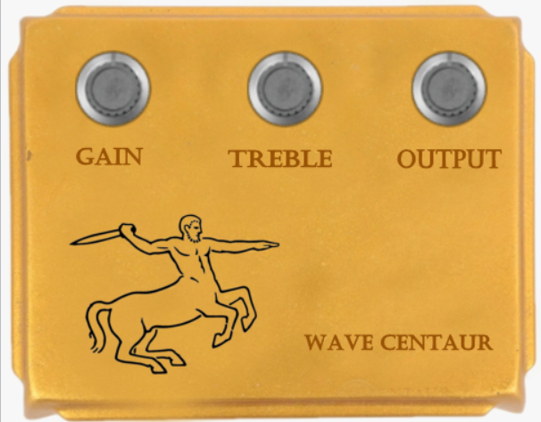

# Wave Centaur: a simulation of the famous Klon Centaur guitar pedal based on Wave Digital Filters modeling
This project is a Virtual Analog plugin version of the Klon Centaur overdrive distortion pedal, based on Wave Digital Filters (WDFs), suitable to be integrated into common digital audio workstations (DAWs). The design followed a white-box approach, discretizing the circuit elements present in the original schematics. We accomplished a real-time and efficient simulation of the pedal.

## JUCE plugin Architecture
In the analysis of the Centaur we adopted the stage decomposition of the circuit operated by ElectroSmash.

 

Each stage was then decomposed in its WDFs counterpart,and the circuit response was inspected as follows:
- The input of a stage was expressed as a voltage, and this value gets transformed in wave domain 
- The wave counterpart propagate in the WDFs version of the stage, until it reaches the output port, which is the node of input of the following stage in the circuit schematics
- The voltage value gets recovered from the incident and reflected wave at the output port 
- This value is the voltage applied at the next stage of the circuit, until the output is reached
We followed the very same idea regarding the plugin architecture: each stage has its C++ counterpart expressed as a function, which is the WDFs engine that simulate each circuit section's behaviour, and as a struct, which encapsulated all the original circuit values and the necessary parameters for the computation of the output values. Every input sample is cascaded through each stage of the simulation, ending up in the output stream seamlessly

## How to use the plugin
 

The reader can immediately recognize in the figure the original Centaur design we decided to adopt for our model’s gui.
The user can easily regulate the amount of distortion, the treble control and the output volume desired setting the value of the three potentiometers, as possible with the original pedal.

### Installing

* Clone/download the repository
* Create a new basic-plugin in Projucer or via CMake
* Copy the .cpp and .h files in the Source and build the project with your favourite IDE

### Executing program

Once you obtain the VST/VST3 file (follow the previous steps) you have simply to open it in a DAW assigning it to a MIDI or audio channel and start playing with the potentiometers! We are sure you will have a good time!

## Authors

Jacopo Barzon and Francesco Boarino

## References

* A. Fettweis, “Wave digital filters: Theory and practice,” Pro-
ceedings of the IEEE, vol. 74, no. 2, pp. 270–327, 1986.
* Proverbio, A. Bernardini, and A. Sarti, “Toward the wave
digital real-time emulation of audio circuits with multiple non-
linearities,” 10 2020.
* J. Zhang and J. O. S. III, “Real-time wave digital simulation
of cascaded vacuum tube amplifiers using modified blockwise
method,” Proceedings of the 21st International Conference on
Digital Audio Effects (DAFx-18), 9 2018.
* R. Giampiccolo, M. de Bari, A. Bernardini, and A. Sarti, “Wave
digital modeling and implementation of nonlinear audio cir-
cuits with nullors,” IEEE/ACM Transactions on Audio, Speech,
and Language Processing, vol. 29, pp. 3267–3279, 10 2021.
*  A. Bernardini, P. Maffezzoni, L. Daniel, and A. Sarti, “Wave-
based analysis of large nonlinear photovoltaic arrays,” IEEE
Transactions on Circuits and Systems I: Regular Papers,
vol. PP, pp. 1–14, 10 2017.
*  A. Bernardini, K. Werner, A. Sarti, and J. Smith, “Modeling
nonlinear wave digital elements using the lambert function,”
IEEE Transactions on Circuits and Systems I: Regular Papers,
vol. 63, pp. 1231–1242, 08 2016.
*  D. Albertini, A. Bernardini, and A. Sarti, “Antiderivative an-
tialiasing techniques in nonlinear wave digital structures,” Jour-
nal of the Audio Engineering Society, vol. 69, pp. 448–464, 11 2021.

